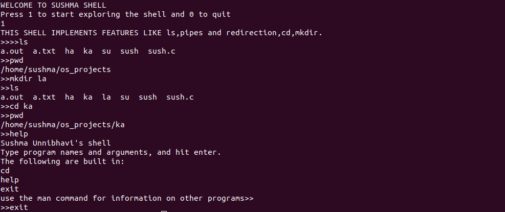

# Sush: Command line interpreter

**Su**shma **Sh**ell, is a command line interpreter written in C.

## Features and Usage

'>>' is output after execution after each command.
 
 four commands are implemented:
 - cd   : can be used to change the working directory
 - exit : exit from sush shell
 - help : used to find out more about how to use the commands using man page
 

##Output:

## Stuff to add
- [ ] redirection

